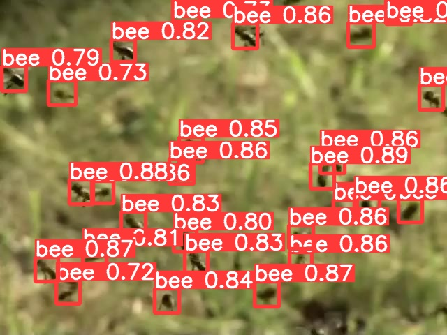
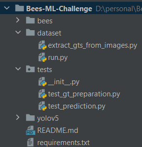

# Bees Challenge

Results can be replicated using python3.6. 

`requirements.txt` is available at the root directory

## Data Preparation

Given the white pixels as the centroid of the bees, it was very easy to extract their location in the image and assume any breadth and width of the bounding box while making sure the width and height stays inside the image.

To generate the labels for yolo, place the `honeybee` folder which comes with the challenge, inside `dataset` directory.

`cd dataset`

`python run`

The output is dumped inside `gts` folder, next to `honeybee` folder

## Training and Validation

Retrain and validate results using [this](https://colab.research.google.com/drive/1mOusdHw_g4iavgD0FrCcc_asQ6a4e9gc?usp=sharing) google colab notebook

## Count the number of bees

`cd yolov5`

`python sample_solution --source "beeType1_115.jpg"`

It should print the numbers of bees in the picture. By default, the confidence threshold is set to 0.7.

## Run tests

`pytests`

That's it. That's the command

## Training Methodology

The go-to computer vision model for a task where the requirement is to calculate the frequency of any item in the image, the first model that comes to any engineer's mind is Yolo.

I started with Yolov7, but it turned out that its training is unstable and has many issues about on Github regarding the same, which made me go for v5.

## Limitations

Yolo isn't good for overlapping objects. Since there are many overlapping bees in the given dataset, yolo might not be the best object detector model to solve this problem.

## Room for improvement

### Tweaking the hyper params

There is a room for tweaking hyperparams to get the best accuracy

### Different sizes for Yolo

Yolo provides small, medium, large and many other models to try out. If had more time, I would like to spend more time experimenting with them

### Data Augmentation

Its unclear whether the background of bees, lights, distance of bees from the camera will remain the same. Hence I went for all the data augmentations which ultralytics version of yolov5 comes with.

However, sometimes data augmentations backfire, if implemented the wrong ones. That's why the questions raised above are to be taken seriously.

### Yolov7

Ideally I would have liked to spend more time debugging yolov7, because it is superior to yolov5.

### Research latest object detection literature

I would like to spend more time doing research on which object detection model will work best for this problem other than yolo.

### OOP

The codebase isn't too big. Otherwise, I would have like to go for OOP.

# Note

Any trouble with replicating the results? Feel free to contact to me. I might have slipped committing any important file or might have made a bug while refactoring the code.